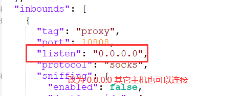
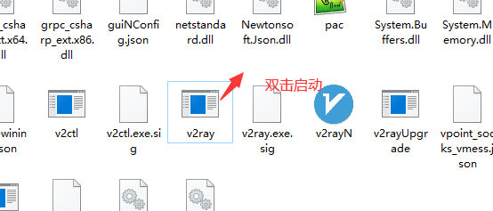

#### 在 CentOS 7 上部署 Kubernetes 集群 (国内网)

##### 1、服务器说明和配置

> master: 188.188.1.151
>
> worker1: 188.188.1.152
>
> worker2: 188.188.1.153

在 hosts 文件中添加主机名解析

```
188.188.1.151	centos76-001
188.188.1.152	centos76-002
188.188.1.153	centos76-003
```

##### 2、在 master 和 worker 上安装 docker

```
# Install Docker CE
## Set up the repository
### Install required packages.
yum install yum-utils device-mapper-persistent-data lvm2

### Add Docker repository.
yum-config-manager \
  --add-repo \
  https://download.docker.com/linux/centos/docker-ce.repo

## Install Docker CE.
yum update && yum install docker-ce-18.06.2.ce

## Create /etc/docker directory.
mkdir /etc/docker

# Setup daemon.
cat > /etc/docker/daemon.json <<EOF
{
  "exec-opts": ["native.cgroupdriver=systemd"],
  "log-driver": "json-file",
  "log-opts": {
    "max-size": "100m"
  },
  "storage-driver": "overlay2",
  "storage-opts": [
    "overlay2.override_kernel_check=true"
  ]
}
EOF

mkdir -p /etc/systemd/system/docker.service.d

# Restart Docker
systemctl daemon-reload
systemctl enable docker
systemctl restart docker
```

##### 3、在 master 和 worker 上安装 kubernetes

```
# cat /etc/yum.repos.d/kubernetes.repo
[kubernetes]
name=Kubernetes
baseurl=http://mirrors.aliyun.com/kubernetes/yum/repos/kubernetes-el7-x86_64
enabled=1
gpgcheck=0
repo_gpgcheck=0
gpgkey=http://mirrors.aliyun.com/kubernetes/yum/doc/yum-key.gpg
       http://mirrors.aliyun.com/kubernetes/yum/doc/rpm-package-key.gpg

# yum install -y kubelet kubeadm kubectl --disableexcludes=kubernetes
# systemctl enable kubelet
# systemctl start kubelet
```

##### 4、在 master 和 worker 上使用以下脚本 pull.sh 下载镜像

```
#!/bin/bash
for i in `kubeadm config images list`; do 
  imageName=${i#k8s.gcr.io/}
  docker pull registry.aliyuncs.com/google_containers/$imageName
  docker tag registry.aliyuncs.com/google_containers/$imageName k8s.gcr.io/$imageName
  docker rmi registry.aliyuncs.com/google_containers/$imageName
done
```

##### 5、在 master 上执行初始化

> --pod-network-cidr=10.244.0.0/16 参数指定是 **flannel** 网络的网段，用于 pods 直接的通信

```
kubeadm init --pod-network-cidr=10.244.0.0/16
```

##### 6、在 master 上安装 flannel 网络

```
wget https://raw.githubusercontent.com/coreos/flannel/62e44c867a2846fefb68bd5f178daf4da3095ccb/Documentation/kube-flannel.yml
kubectl apply -f kube-flannel.yml
kubectl get pods --all-namespaces # 如果 CoreDNS pod 是 up 和 running的，则安装成功
```

如果出现以下错误，则说明镜像下载失败，手动下载镜像看看是否能成功


##### 7、将 woker 添加到集群中

```
kubeadm join --token <token> <master-ip>:<master-port> --discovery-token-ca-cert-hash sha256:<hash>
```

##### 8、在 master 上查看节点

```
[root@centos76-001 ~]# kubectl get pods --all-namespaces 
NAMESPACE     NAME                                   READY   STATUS    RESTARTS   AGE
kube-system   coredns-5c98db65d4-7msm2               1/1     Running   0          51m
kube-system   coredns-5c98db65d4-qlpk9               1/1     Running   0          51m
kube-system   etcd-centos76-001                      1/1     Running   0          50m
kube-system   kube-apiserver-centos76-001            1/1     Running   0          50m
kube-system   kube-controller-manager-centos76-001   1/1     Running   0          50m
kube-system   kube-flannel-ds-amd64-bmhvr            1/1     Running   0          42m
kube-system   kube-flannel-ds-amd64-lm7hq            1/1     Running   0          73s
kube-system   kube-flannel-ds-amd64-wkwgs            1/1     Running   0          42m
kube-system   kube-proxy-8qw9v                       1/1     Running   0          47m
kube-system   kube-proxy-c79fz                       1/1     Running   0          51m
kube-system   kube-proxy-jjrtx                       1/1     Running   0          73s
kube-system   kube-scheduler-centos76-001            1/1     Running   0          50m
[root@centos76-001 ~]# kubectl get nodes
NAME           STATUS   ROLES    AGE   VERSION
centos76-001   Ready    master   52m   v1.15.3
centos76-002   Ready    <none>   47m   v1.15.3
centos76-003   Ready    <none>   80s   v1.15.3
```


#### 在 CentOS 7 上部署 Kubernetes 集群 (翻墙)

##### 准备翻墙环境

下载翻墙工具 [Chrome一键翻墙包](<http://d1.bdrive.tk/cg.7z>)

修改翻墙工具配置文件 D:\ChromeGo\v2rayB\config.json

> 以 v2ray 为例



启动



##### 在 CentOS 服务器上安装 Privoxy

编译

```
wget http://www.privoxy.org/sf-download-mirror/Sources/3.0.28%20%28stable%29/privoxy-3.0.28-stable-src.tar.gz
tar -zxvf privoxy-3.0.28-stable-src.tar.gz
cd privoxy-3.0.28-stable
useradd privoxy
yum install autoconf automake libtool
autoheader && autoconf
./configure
make && make install
```

修改配置文件 /usr/local/etc/privoxy/config

> 192.168.1.10 为 CentOS 主机的 IP
>
> 192.168.1.8 为运行 v2ray 主机的 IP

```
listen-address  192.168.1.10:8118
forward-socks5t / 192.168.1.8:10808 .
```

启动

```
privoxy --user privoxy /usr/local/etc/privoxy/config
```

启用代理

```
export http_proxy=http://192.168.1.10:8118
export https_proxy=http://192.168.1.10:8118
export no_proxy=localhost,127.0.0.1,192.168.1.8
```

测试

```
curl -I www.google.com
```

##### 配置 docker 

> 镜像下载完后应还原

修改文件 /usr/lib/systemd/system/docker.service，添加 Environment

```
[Service]
Environment="HTTP_PROXY=http_proxy=http://192.168.40.201:8118" "HTTPS_PROXY=http://192.168.40.201:8118" "NO_PROXY=localhost,192.168.1.8,127.0.0.1,10.96.0.0/12,192.168.99.0/24,192.168.39.0/24"
```

重启 docker

```
systemctl daemon-reload
systemctl restart docker
```

##### 部署 k8s

初始化 master

```
kubeadm init --pod-network-cidr=10.244.0.0/16
```


#### 教程

##### 集群

查看集群

```
kubectl cluster-info
```

查看节点

```
kubectl get nodes
```

##### 创建 deployment

发布应用

```
kubectl create deployment kubernetes-bootcamp --image=gcr.io/google-samples/kubernetes-bootcamp:v1
```

查看

```
kubectl get deployments
```

启动代理

```
kubectl proxy
```

测试

```
curl http://localhost:8001/version
```

查看 pod 名字

```
export POD_NAME=$(kubectl get pods -o go-template --template '{{range .items}}{{.metadata.name}}{{"\n"}}{{end}}')
echo Name of the Pod: $POD_NAME
```

#### 了解应用

查看 pod 详情

```
kubectl describe pods
```

查看 pod 日志

```
kubectl logs kubernetes-bootcamp-6f6656d949-gsjj5
```

在 pod 中执行命令

```
kubectl exec kubernetes-bootcamp-6f6656d949-gsjj5 env
```

登录 pod

```
kubectl exec -it kubernetes-bootcamp-6f6656d949-gsjj5 -- bash
```

##### 暴露应用

查看 deployments

```
kubectl get deployments
```

查看服务

```
kubectl get services
```

创建服务

```
kubectl expose deployment/kubernetes-bootcamp --type="NodePort" --port 8080
```

查看服务详情

```
kubectl describe services/kubernetes-bootcamp
```

查看 NODE_PORT

```
export NODE_PORT=$(kubectl get services/kubernetes-bootcamp -o go-template='{{(index .spec.ports 0).nodePort}}')
echo NODE_PORT=$NODE_PORT
```

访问服务

```
curl http://NODE_IP:NODE_PORT
```


#### 部署应用程序

##### 部署使用服务访问的应用程序

>**目标** 
>
>- 运行Hello World应用程序的两个实例。
>- 创建一个公开节点端口的Service对象。
>- 使用Service对象访问正在运行的应用程序。

1、创建文件 hello-application.yaml

```
apiVersion: apps/v1
kind: Deployment
metadata:
  name: hello-world
spec:
  selector:
    matchLabels:
      run: load-balancer-example
  replicas: 2
  template:
    metadata:
      labels:
        run: load-balancer-example
    spec:
      containers:
        - name: hello-world
          image: nginx
          ports:
            - containerPort: 80
              protocol: TCP
```

2、部署应用程序

```
kubectl apply -f hello-application.yaml 
```

3、显示部署信息

```
kubectl get deployments hello-world
kubectl describe deployments hello-world
```

4、显示 ReplicaSet 信息

```
kubectl get replicasets
kubectl describe replicasets
```

5、创建公开部署的Service对象

```
kubectl expose deployment hello-world --type=NodePort --name=example-service
```

6、显示服务信息

```
# kubectl describe services example-service
Name:                     example-service
Namespace:                default
Labels:                   <none>
Annotations:              <none>
Selector:                 run=load-balancer-example
Type:                     NodePort
IP:                       10.99.118.198
Port:                     <unset>  80/TCP
TargetPort:               80/TCP
NodePort:                 <unset>  31826/TCP
Endpoints:                10.244.1.10:80,10.244.5.11:80
Session Affinity:         None
External Traffic Policy:  Cluster
Events:                   <none>
```

7、显示 pods 信息

```
kubectl get pods --selector="run=load-balancer-example" --output=wide
```


8、通过 node ip 访问集群

```
# curl -I http://188.188.1.152:31826
HTTP/1.1 200 OK
Server: nginx/1.17.3
Date: Wed, 28 Aug 2019 10:43:48 GMT
Content-Type: text/html
Content-Length: 612
Last-Modified: Tue, 13 Aug 2019 08:50:00 GMT
Connection: keep-alive
ETag: "5d5279b8-264"
Accept-Ranges: bytes
```

##### 部署指定节点和 NodePort 的应用

> nodeName 指定节点，nodePort 指定节点端口，type 指定服务类型，默认为 ClusterIP

创建部署 yaml 文件 redis-master-deployment.yaml 

```
apiVersion: apps/v1 # for versions before 1.9.0 use apps/v1beta2
kind: Deployment
metadata:
  name: redis-master
  labels:
    app: redis
spec:
  selector:
    matchLabels:
      app: redis
      role: master
      tier: backend
  replicas: 1
  template:
    metadata:
      labels:
        app: redis
        role: master
        tier: backend
    spec:
      nodeName: centos76-003
      containers:
      - name: master
        image: redis  # or just image: redis
        resources:
          requests:
            cpu: 100m
            memory: 100Mi
        ports:
        - containerPort: 6379
```

创建服务 yaml 文件 redis-master-service.yaml 

```
apiVersion: v1
kind: Service
metadata:
  name: redis-master
  labels:
    app: redis
    role: master
    tier: backend
spec:
  ports:
  - port: 6379
    targetPort: 6379
    nodePort: 30001
  selector:
    app: redis
    role: master
    tier: backend
  type: NodePort
```

应用 yaml 文件

```
kubectl apply -f redis-master-deployment.yaml
kubectl apply -f redis-master-service.yaml 
```

查看 pod 信息

```
kubectl get pods --output=wide
```


查看服务信息

```
# kubectl get service redis-master
NAME           TYPE       CLUSTER-IP       EXTERNAL-IP   PORT(S)          AGE
redis-master   NodePort   10.102.248.122   <none>        6379:30001/TCP   18m
```

测试登陆 redis

```
# redis-cli -h centos76-003 -p 30001
centos76-003:30001> set k 123456
OK
centos76-003:30001> get k
"123456"
```

##### 部署挂载 NODE 目录的应用

```
apiVersion: v1
kind: Pod
metadata:
  name: vol-emptydir-pod
spec:
  volumes:
  - name: html
    # emptyDir: { }
    hostPath:
      path: /tmp/html
      type: DirectoryOrCreate
  containers:
  - name: nginx
    image: nginx:latest
    volumeMounts:
    - name: html
      mountPath: /usr/share/nginx/html
  - name: pagegen
    image: alpine
    volumeMounts:
    - name: html
      mountPath: /html
    command: [ "/bin/sh", "-c" ]
    args:                        #定义循环，每10秒向/html/文件中追加写入当前主机名和时间
    - while true; do
        echo $(hostname) $(date) >> /html/index.html;
        sleep 10;
      done
```

##### 部署挂载 NFS 目录的应用

> 一个 pv 对应 一个 pvc
>
> 如果存在多个可用的 pv，创建 pvc 时会自动选择 pc

```
# This mounts the nfs volume claim into /mnt and continuously
# overwrites /mnt/index.html with the time and hostname of the pod.
---
apiVersion: v1
kind: PersistentVolume
metadata:
  name: project-a-pv
spec:
  capacity:
    storage: 10Gi
  accessModes:
    - ReadWriteMany
  nfs:
    server: 192.168.1.10
    path: "/nfsdisk"
---
apiVersion: v1
kind: PersistentVolumeClaim
metadata:
  name: project-a-pvc
spec:
  accessModes:
    - ReadWriteMany
  storageClassName: ""
  resources:
    requests:
      storage: 10Gi
---
apiVersion: v1
kind: ReplicationController
metadata:
  name: nfs-busybox
spec:
  replicas: 2
  selector:
    name: nfs-busybox
  template:
    metadata:
      labels:
        name: nfs-busybox
    spec:
      containers:
      - image: busybox
        command:
          - sh
          - -c
          - 'while true; do echo `date`:`hostname` >> /mnt/index.html; sleep 1s; done'
        imagePullPolicy: IfNotPresent
        name: busybox
        volumeMounts:
          # name must match the volume name below
          - name: html
            mountPath: "/mnt"
      volumes:
      - name: html
        persistentVolumeClaim:
          claimName: project-a-pvc
```


#### 资料

**Kubernet**

- [Kubernetes中文指南/云原生应用架构实践手册](<https://jimmysong.io/kubernetes-handbook/>)

**Docker**

- [Docker Handbook](<https://jimmysong.io/docker-handbook/>)


#### 常用命令

通过 pod 登陆容器

```
# kubectl get pods
NAME                                READY   STATUS    RESTARTS   AGE
mysql-7d7fdd478f-vvtfw              1/1     Running   0          5h18m
nginx-deployment-6f655f5d99-2twx8   1/1     Running   0          5h32m
nginx-deployment-6f655f5d99-rgmvs   1/1     Running   0          5h32m
# kubectl exec -it mysql-7d7fdd478f-vvtfw -- /bin/bash
root@mysql-7d7fdd478f-vvtfw:/# 
```

查看 pod 日志

```
kubectl logs podname
```

登录到 pod 容器中

```
kubectl exec POD_NAME -c CONTAINER_NAME -it -- sh
```


#### 常见问题

##### coredns 无法启动

/var/log/message 日志报一下错误

```
Jul 10 16:28:19 centos7-001 kubelet: W0710 16:28:19.505758   16742 cni.go:331] CNI failed to retrieve network namespace path: cannot find network namespace for the terminated container "77dc0fbb3f9f1e9c1f017ced6748dbba08e374cc3b46832d87d8d4632153fb15"
Jul 10 16:28:19 centos7-001 kubelet: E0710 16:28:19.585270   16742 cni.go:385] Error deleting kube-system_coredns-689857ddd7-r6lw2/77dc0fbb3f9f1e9c1f017ced6748dbba08e374cc3b46832d87d8d4632153fb15 from network calico/k8s-pod-network: error getting ClusterInformation: Get https://[10.96.0.1]:443/apis/crd.projectcalico.org/v1/clusterinformations/default: x509: certificate signed by unknown authority (possibly because of "crypto/rsa: verification error" while trying to verify candidate authority certificate "kubernetes")
Jul 10 16:28:19 centos7-001 kubelet: E0710 16:28:19.586460   16742 remote_runtime.go:128] StopPodSandbox "77dc0fbb3f9f1e9c1f017ced6748dbba08e374cc3b46832d87d8d4632153fb15" from runtime service failed: rpc error: code = Unknown desc = networkPlugin cni failed to teardown pod "coredns-689857ddd7-r6lw2_kube-system" network: error getting ClusterInformation: Get https://[10.96.0.1]:443/apis/crd.projectcalico.org/v1/clusterinformations/default: x509: certificate signed by unknown authority (possibly because of "crypto/rsa: verification error" while trying to verify candidate authority certificate "kubernetes")
```

coredns pod 的状态


处理方法

```
mv /etc/cni/net.d/10-calico.conflist /tmp/
mv /etc/cni/net.d/calico-kubeconfig /tmp/
```

再次检查状态，运行正常


##### coredns ip 无法 ping 通

检查 pod 发现不在同一个子网

