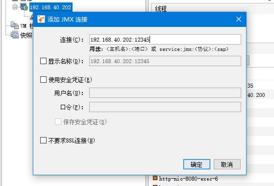

#### 常用命令

生成线程 dump，用于分析 CUP 负载过高

> pid 为进程号

```
jstack pid >/tmp/stackdump
```

生成堆 dump，用于分析内存溢出

> pid 为进程号

```
jmap -dump:live,format=b,file=/tmp/heapdump.hprof pid
```


#### 使用 Eclipse Memory Analyzer 分析堆 dump


#### 常用 jvm 参数

| 描述                         | 配置格式                             |
| ---------------------------- | ------------------------------------ |
| 初始化堆空间大小             | -Xms64m                              |
| 最大堆空间大小               | -Xmx128m                             |
| 当抛出OOM时进行HeapDump      | -XX:+HeapDumpOnOutOfMemoryError      |
| 指定HeapDump的文件路径和目录 | -XX:HeapDumpPath=/tmp/heapdump.hprof |


#### 使用 Java VisualVM 监控 tomcat 运行状态

在 catalina.sh 添加以下参数，开启 jmx

```
CATALINA_OPTS="-Dcom.sun.management.jmxremote -Dcom.sun.management.jmxremote.authenticate=false -Dcom.sun.management.jmxremote.port=12345 -Dcom.sun.management.jmxremote.ssl=false -Djava.rmi.server.hostname=192.168.40.202"
```

在 Windows 上进入目录 C:\Program Files\Java\jdk1.8.0_271\bin，双击 jvisualvm.exe 打开 Java VisualVM


添加远程主机


创建 jmx 连接




#### 常见故障

##### Java程序导致服务器CPU占用率过高

1、故障现象
客服同事反馈平台系统运行缓慢，网页卡顿严重，多次重启系统后问题依然存在，使用top命令查看服务器情况，发现CPU占用率过高。

2、CPU占用过高问题定位
2.1、定位问题进程
使用top命令查看资源占用情况，发现pid为14063的进程占用了大量的CPU资源，CPU占用率高达776.1%，内存占用率也达到了29.8%

```
[ylp@ylp-web-01 ~]$ top
top - 14:51:10 up 233 days, 11:40,  7 users,  load average: 6.85, 5.62, 3.97
Tasks: 192 total,   2 running, 190 sleeping,   0 stopped,   0 zombie
%Cpu(s): 97.3 us,  0.3 sy,  0.0 ni,  2.5 id,  0.0 wa,  0.0 hi,  0.0 si,  0.0 st
KiB Mem : 16268652 total,  5114392 free,  6907028 used,  4247232 buff/cache
KiB Swap:  4063228 total,  3989708 free,    73520 used.  8751512 avail Mem 
  PID USER      PR  NI    VIRT    RES    SHR S  %CPU %MEM     TIME+ COMMAND                                                                                               

14063 ylp       20   0 9260488 4.627g  11976 S 776.1 29.8 117:41.66 java    
```

2.2、定位问题线程
使用ps -mp pid -o THREAD,tid,time命令查看该进程的线程情况，发现该进程的多个线程占用率很高，**如果无法查到使用命令 top -Hp PID 查**

```
[ylp@ylp-web-01 ~]$ ps -mp 14063 -o THREAD,tid,time
USER     %CPU PRI SCNT WCHAN  USER SYSTEM   TID     TIME
ylp       361   -    - -         -      -     - 02:05:58
ylp       0.0  19    - futex_    -      - 14063 00:00:00
ylp       0.0  19    - poll_s    -      - 14064 00:00:00
ylp      44.5  19    - -         -      - 14065 00:15:30
ylp      44.5  19    - -         -      - 14066 00:15:30
ylp      44.4  19    - -         -      - 14067 00:15:29
ylp      44.5  19    - -         -      - 14068 00:15:30
ylp      44.5  19    - -         -      - 14069 00:15:30
ylp      44.5  19    - -         -      - 14070 00:15:30
ylp      44.5  19    - -         -      - 14071 00:15:30
ylp      44.6  19    - -         -      - 14072 00:15:32
ylp       2.2  19    - futex_    -      - 14073 00:00:46
ylp       0.0  19    - futex_    -      - 14074 00:00:00
ylp       0.0  19    - futex_    -      - 14075 00:00:00
ylp       0.0  19    - futex_    -      - 14076 00:00:00
ylp       0.7  19    - futex_    -      - 14077 00:00:15
```

从输出信息可以看出，14065~14072之间的线程CPU占用率都很高

2.3、查看问题线程堆栈
挑选TID为14065的线程，查看该线程的堆栈情况，先将线程id转为16进制，使用printf "%x\n" tid命令进行转换

```
[ylp@ylp-web-01 ~]$ printf "%x\n" 14065
36f1
```

再使用jstack命令打印线程堆栈信息，命令格式：jstack pid |grep tid -A 30

```
[ylp@ylp-web-01 ~]$ jstack 14063 |grep 36f1 -A 30
"GC task thread#0 (ParallelGC)" prio=10 tid=0x00007fa35001e800 nid=0x36f1 runnable 
"GC task thread#1 (ParallelGC)" prio=10 tid=0x00007fa350020800 nid=0x36f2 runnable 
"GC task thread#2 (ParallelGC)" prio=10 tid=0x00007fa350022800 nid=0x36f3 runnable 
"GC task thread#3 (ParallelGC)" prio=10 tid=0x00007fa350024000 nid=0x36f4 runnable 
"GC task thread#4 (ParallelGC)" prio=10 tid=0x00007fa350026000 nid=0x36f5 runnable 
"GC task thread#5 (ParallelGC)" prio=10 tid=0x00007fa350028000 nid=0x36f6 runnable 
"GC task thread#6 (ParallelGC)" prio=10 tid=0x00007fa350029800 nid=0x36f7 runnable 
"GC task thread#7 (ParallelGC)" prio=10 tid=0x00007fa35002b800 nid=0x36f8 runnable 
"VM Periodic Task Thread" prio=10 tid=0x00007fa3500a8800 nid=0x3700 waiting on condition 

JNI global references: 392
```

从输出信息可以看出，此线程是JVM的gc线程。此时可以基本确定是内存不足或内存泄露导致gc线程持续运行，导致CPU占用过高。
所以接下来我们要找的内存方面的问题

3、内存问题定位
3.1、使用jstat -gcutil命令查看进程的内存情况

```
[ylp@ylp-web-01 ~]$ jstat -gcutil 14063 2000 10

  S0     S1     E      O      P     YGC     YGCT    FGC    FGCT     GCT   
  0.00   0.00 100.00  99.99  26.31     42   21.917   218 1484.830 1506.747
  0.00   0.00 100.00  99.99  26.31     42   21.917   218 1484.830 1506.747
  0.00   0.00 100.00  99.99  26.31     42   21.917   219 1496.567 1518.484
  0.00   0.00 100.00  99.99  26.31     42   21.917   219 1496.567 1518.484
  0.00   0.00 100.00  99.99  26.31     42   21.917   219 1496.567 1518.484
  0.00   0.00 100.00  99.99  26.31     42   21.917   219 1496.567 1518.484
  0.00   0.00 100.00  99.99  26.31     42   21.917   219 1496.567 1518.484
  0.00   0.00 100.00  99.99  26.31     42   21.917   220 1505.439 1527.355
  0.00   0.00 100.00  99.99  26.31     42   21.917   220 1505.439 1527.355
  0.00   0.00 100.00  99.99  26.31     42   21.917   220 1505.439 1527.355
```

从输出信息可以看出，Eden区内存占用100%，Old区内存占用99.99%，Full GC的次数高达220次，并且频繁Full GC，Full GC的持续时间也特别长，平均每次Full GC耗时6.8秒（1505.439/220）。根据这些信息，基本可以确定是程序代码上出现了问题，可能存在不合理创建对象的地方

3.2、分析堆栈
使用jstack命令查看进程的堆栈情况

```
[ylp@ylp-web-01 ~]$ jstack 14063 >>jstack.out
```

把jstack.out文件从服务器拿到本地后，用编辑器查找带有项目目录并且线程状态是RUNABLE的相关信息，从图中可以看出ActivityUtil.java类的447行正在使用HashMap.put()方法

Paste_Image.png
3.3、代码定位
打开项目工程，找到ActivityUtil类的477行，代码如下：

Paste_Image.png
找到相关同事了解后，这段代码会从数据库中获取配置，并根据数据库中remain的值进行循环，在循环中会一直对HashMap进行put操作。

查询数据库中的配置，发现remain的数量巨大

Paste_Image.png
至此，问题定位完毕。

参考文档：[记一次线上Java程序导致服务器CPU占用率过高的问题排除过程](https://www.jianshu.com/p/3667157d63bb)


#### 脚本

获取 java 线程 的 jvm 堆栈信息

```shell
#!/bin/bash
TOP15_PROC="/tmp/proc"
TOP15_THRD="/tmp/thrd"

top -d 5 -n 1 -b | grep java | grep www | grep -v grep >${TOP15_PROC}

cat ${TOP15_PROC} | while read PROC
do
    PROC_ID=`echo $PROC | awk '{print $1}'`
    PROC_CPU=`echo $PROC | awk '{print $9}'`
    if [ `echo "$PROC_CPU > 50.0" | bc` -eq 1 ]; then
        echo -e "\n\n\n`date`"
        echo -e "\n进程 ${PROC_ID} 的 CPU 使用率为 ${PROC_CPU}%"
        ps -ef | grep ${PROC_ID} | grep -v grep
        
        /usr/local/jdk1.7.0_79/bin/jstack ${PROC_ID} >/tmp/stack/`date +%H%M`-${PROC_ID}

        top -d 5 -n 1 -b -Hp ${PROC_ID} | grep java | grep www | grep -v grep >${TOP15_THRD}

        cat ${TOP15_THRD} | while read THRD
        do
            THRD_ID=`echo $THRD | awk '{print $1}'`
            THRD_CPU=`echo $THRD | awk '{print $9}'`
            if [ `echo "$THRD_CPU > 10.0" | bc` -eq 1 ]; then
                OX_TID=`printf "%x\n" ${THRD_ID}`
                echo -e "\n进程 ${PROC_ID} 的线程 ${THRD_ID}($OX_TID) 的 CPU 使用率为 ${THRD_CPU}%"
                /usr/local/jdk1.7.0_79/bin/jstack ${PROC_ID} | sed "/0x${OX_TID}/, /^$/!d"
            fi
        done
    fi
done
```

